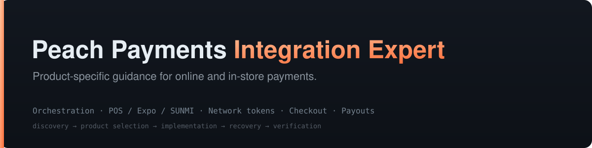

<div align="center">



<p>


</p>

</div>

A skill for AI coding agents building, maintaining and reviewing Peach Payments integrations.
It helps select the right product, implement its payment flow, and handle failures without
confusing credentials, amount units, tokens or transaction states between products.

**v0.8.0 adds custom POS and Expo/SUNMI guidance, an Orchestration build playbook, a dedicated
network-tokenisation guide, and documentation freshness checks that include page content.**
Read the [changelog](CHANGELOG.md) and [documentation audit](docs-audit-2026-10-07.md).

Unofficial and community-built. Sources are public Peach documentation and the open-source
[Medusa community plugin](https://github.com/max-bissolati/medusa-payment-peach-payments).
This skill does not certify a merchant integration or replace Peach account enablement and UAT.

## Coverage

| Task | Start here |
|---|---|
| Choose a product or supported platform plugin | [Product routing](references/products-and-routing.md), [plugin matrix](references/plugins/_matrix.md) |
| New custom online integration | [Orchestration build playbook](references/playbooks/orchestration-build.md) |
| Embedded or Hosted Orchestration checkout | [Web SDK](references/sdk-web.md) |
| Orchestration API, capture/refund, vault, mandates and MIT | [Orchestration API](references/orchestration-api.md) |
| Network tokens, saved-card tokens, wallet tokens and lifecycle | [Network tokenisation](references/network-tokenisation.md) |
| Customer-facing iOS, Android, React Native or Flutter app | [Mobile SDKs](references/mobile.md) |
| Till on a separate device controlling a Peach terminal | [POS Integrations REST API](references/pos-integrations.md) |
| Custom Expo cashier app on a SUNMI terminal | [Expo/SUNMI and Android Intent](references/pos-expo-sunmi.md) |
| Existing classic Checkout or Payments API | [Checkout V2](references/checkout-v2.md), [Payments API](references/payments-api.md) |
| Payment links and invoices | [Payment Links](references/payment-links.md) |
| Subscriptions and failed renewals | [Recurring payments](references/recurring-and-tokenisation.md), [renewal recovery](references/playbooks/failed-renewal-card-expiry.md) |
| Payouts, reconciliation and settlement | [Payouts](references/payouts.md), [reconciliation](references/reconciliation.md) |
| Webhooks, security and launch checks | [Webhooks](references/webhooks.md), [security](references/pci-security.md), [testing](references/testing-and-go-live.md) |

Peach currently recommends Orchestration for new custom online integrations. Existing classic
products retain their own contracts. Platform stores should use a suitable supported extension;
Medusa's plugin is community-maintained. Card-present POS uses a separate REST or Android Intent
surface. An online mobile SDK does not control a physical terminal's card reader.

## Install and use

Copy or symlink the repository into the skills directory supported by your agent, such as
`.agents/skills/peach-payments-integration-expert`, `~/.codex/skills/peach-payments-integration-expert`,
or `~/.claude/skills/peach-payments-integration-expert`.

Ask the agent to use `peach-payments-integration-expert` with a concrete task, for example:

- “Plan an Expo cashier app running on a Peach SUNMI terminal.”
- “Integrate Orchestration Hosted Checkout and reconcile payment outcomes.”
- “Review our saved-card renewal flow and explain whether network tokens help.”
- “Investigate this uncertain POS refund without retrying it.”

[SKILL.md](SKILL.md) routes the task to the relevant references. The agent should infer known
requirements from the project and ask only for missing details that affect the design.

## Product boundaries

- Classic Checkout and Payments API use decimal-string major units. Orchestration, POS and the
  Payouts API use integer minor units. Dashboard bulk payout spreadsheets use major units.
- Success, webhook authentication and recovery depend on the product. POS `202` is dispatch
  acceptance, not payment success; classic `result.code` helpers cannot classify POS outcomes.
- Keep merchant secrets on the server. A POS key starting with `pk_live` is not publishable.
- Persist payment attempts before dispatch, correlate amount/currency/order/operation, and prevent
  duplicate fulfilment. A timeout is not proof that a payment or refund failed.
- Saved-card IDs, network tokens and wallet credentials are distinct. A token is not a promise of
  portability, a 3DS exemption, or permission for an off-session charge.
- Follow the skill's authorization gates before money-moving operations. Examples never authorize
  live transactions.

## Tools and validation

Runtime: Node 18+ for the JavaScript helpers; Python 3 and curl for documentation freshness.
The helpers use their runtimes' standard libraries. They do not install application dependencies.

```sh
node scripts/doctor.js
bash scripts/refresh-docs-check.sh
bash scripts/refresh-docs-check.sh --deep
```

The doctor checks script selftests, freshness regressions, reference data, example lint and document
structure/links. Its `HEALTHY` result describes these local checks. It does not prove payment
correctness, live credentials, SDK compatibility or terminal certification.

| Tool | Scope |
|---|---|
| `check-integration.js` | Classic-focused integration lint; a limited error detector, not a security sign-off |
| `verify-webhook.js`, `canonical-string.js`, `webhook-sample.js` | Classic Checkout Scheme A/B signatures and fixtures; not POS or Orchestration webhook verification |
| `preflight.js`, `smoke-test.js` | Their documented online product profiles; no POS profile or money movement |
| `map-result-code.js`, `decode-result.js` | Classic dotted result codes; advice-code automation needs verified network/connector context |
| `doctor.js` | Local health checks and product-specific build guidance |
| `refresh-docs-check.sh` | Read-only index check, or tracked content checks with `--deep` |

The four [reference integrations](examples/) cover classic Checkout V2. Use the Orchestration
playbook or POS guides for those products instead of transplanting classic authentication and
retry logic. POS/Expo guidance has undergone source review and scenario evaluation, but has not
been tested on physical terminals. New tokenisation guidance is documentation-reviewed, not a
claim of token provisioning or acquirer certification.

<details>
<summary><b>Keeping sources current</b></summary>

The historical source baseline is September 2026, with dated updates recorded in
[versions and provenance](references/versions.md). Each tracked source has its own hash and
review note in [docs-baseline.json](scripts/docs-baseline.json).

The default freshness check looks for added/removed index links. `--deep` also checks curated page
bodies, including POS guides absent from Peach's index. `OK` only means the checked sources match;
`UNKNOWN` means a source is unavailable or unbaselined. `DRIFT` requires review, not automatic
rewriting. Expo/SUNMI dependencies and untracked pages still need task-specific verification.

After reviewing a saved source and updating affected references, explicitly accept those bytes:

```sh
bash scripts/refresh-docs-check.sh --accept URL --from-file FILE \
  --review-note 'Reviewed changes and updated the affected reference' \
  --reviewed-on YYYY-MM-DD
```

Normal checks never advance a baseline. Run `--help` for bounds and arguments.
[BACKLOG.md](BACKLOG.md) records remaining hardware checks and public documentation gaps.

</details>

## Repository layout

```text
SKILL.md              task router and integration principles
references/           product guides, platform plugins and build playbooks
scripts/              integration checks, health checks and documentation freshness
reference-data/       machine-readable hosts, methods and result-code families
examples/             classic Checkout V2 examples for Express, Next.js, Flask and PHP
templates/            environment-variable templates
```

## Version and provenance

The latest published version is available in [GitHub Releases](https://github.com/max-bissolati/peach-payments-integration-expert/releases/latest).
The release version is recorded in [VERSION](VERSION). Detailed changes are in
[CHANGELOG.md](CHANGELOG.md); claim-level provenance and verification limits are in
[references/versions.md](references/versions.md).

Not affiliated with, endorsed by, or supported by Peach Payments.
